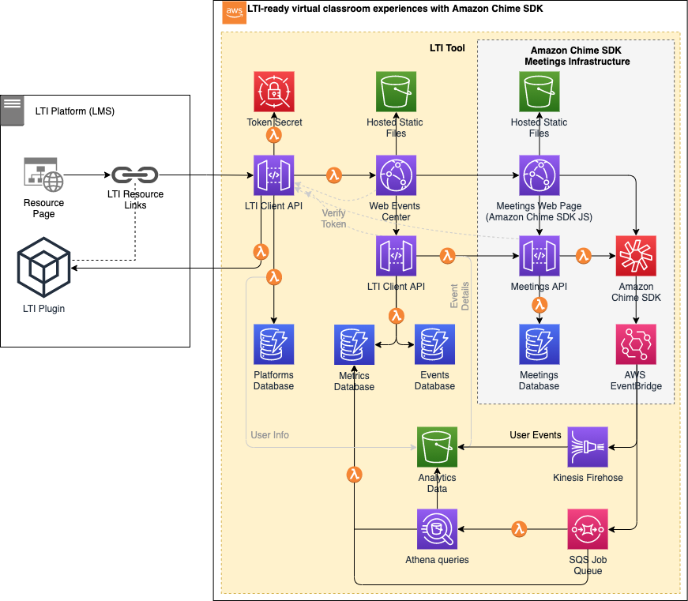

# Create LTI-ready virtual classroom experiences with Amazon Chime SDK

During the COVID-19 global pandemic, many educational institutions
shifted academic instruction to a virtual format and education
technology (EdTech) companies used the cloud to create and scale remote
learning solutions. A
recent [study](https://www.insidehighered.com/news/2021/03/24/student-experiences-during-covid-and-campus-reopening-concerns)
of 2,000 undergraduate students shows that, despite an eager sentiment
to return to in-person classes, most students still want to keep aspects
of remote learning --- 79% want lectures made available online for
review and nearly half want the option to toggle between in-person
classes and online attendance. Virtual learning presents new challenges
for educators, students, and administrators, like securing safe online
spaces for learning, navigating multiple online tools and systems,
creating engaging and custom virtual experiences, and capturing data and
insights to measure efficacy and ultimately student success.

Whether you work in EdTech or higher education, you can enhance your
existing remote learning tool with customization, actionable insights,
and seamless integration into learning management systems (LMS). In this
blog post we show you how to create LTI-ready virtual classroom
experiences with Amazon Chime SDK, so educators and students can easily
navigate to and participate in virtual classes all from their LMS --
minimizing the need to learn a new system. We'll also demonstrate how
educators and administrators can benefit from visibility into class
participation metrics.\
\
[[Amazon Chime SDK](https://aws.amazon.com/chime/chime-sdk/) is a
set of real-time communications components that developers can use to
quickly add messaging, audio, video, and screen sharing capabilities to
their web or mobile applications. Developers can leverage the same
communication infrastructure and services that power Amazon Chime, an
online meetings service from AWS, and deliver engaging experiences in
their applications. You will use [AWS
Amplify](https://aws.amazon.com/amplify/), [AWS Cloud Development
Kit (CDK)](https://aws.amazon.com/cdk/) and [Learning Tools
Interoperability
(LTI)](https://www.imsglobal.org/activity/learning-tools-interoperability)
to integrate Amazon Chime SDK with your LMS.

"The Amazon Chime SDK will help us deliver next-class stability, speed,
Machine Learning-driven noise cancelation, reliability and exquisite
audio-visuals. By allowing AWS to handle these areas of specialized
expertise, we will continue to focus on pedagogically-sound
enhancements. Additionally, with AWS's secure global infrastructure, we
can accelerate the pace by which we bring innovations to
market---meaning more robust, capable tools and features available to
our customers faster than ever."  -Kathy Vieira, Chief Strategy and
Portfolio Officer, Blackboard

## How it works

Let's take a closer look at how this works and walk through the
necessary steps to start and join a Chime meeting as an educator or
student coming from an LMS.

There are four key components:

1.  **LMS system with the LTI plugin configured:** This is supported
    with the LTI Client API which provides endpoints to integrate as an
    LTI tool in an LMS like Moodle, Canvas, or Blackboard. This API also
    issues web tokens and uses AWS Secrets Manager to store a secret
    key.

1.  **Events Center:** a React web application that
    educators will use to create and maintain events and for students to
    review these events. An event represents a scheduled Amazon Chime
    meeting, e.g. a virtual classroom experience, with information like
    event title, date, time, and description. The web application is
    hosted in Amazon S3, distributed via Amazon CloudFront, and also
    uses Amazon DynamoDB tables to store data. Additionally, the Amazon
    Chime Web Events Center subscribes to user events in Amazon Chime
    SDK meetings (via [Amazon
    EventBridge](https://docs.aws.amazon.com/chime/latest/ag/automating-chime-with-cloudwatch-events.html#events-sdk))
    and pulls in event data, e.g. meeting started, ended, attendee
    joined, left, started and stopped sharing screen, etc. The tool
    takes these events and augments them with relevant data like LTI
    user information and event details before aggregating metrics to
    present meaningful insight into Amazon Chime SDK meeting activities.

2.  **Events API:** a backend API for the web application which
    encapsulates persistence logic for events. Also, this API owns
    communication to the Amazon Chime SDK meetings API when initiating
    and joining Amazon Chime SDK meetings.

3.  **Amazon Chime SDK Meeting** where attendees can
    collaborate over audio/video and screen share.

**Deploying and configuring the experience**

To get started with deploying this experience in your AWS account,
follow the steps outlined below:

 **Step 1:** Deploy the [LTI Client API, Events Center,
 and Events API](/lit-components/)

 **Step 2:** Deploy the [Amazon Chime SDK Meeting components](/chime-sdk-components)

 **Step 3:** Configure the [LTI plugin](/lti-components/web/README.md) in your LMS 

**Conclusion**

In this post we covered how you can create LTI-ready virtual classroom
experiences with Amazon Chime SDK and enable educators and students to
participate and collaborate from their LMS. We want to hear more on
features and capabilities that you would like to see in these virtual
learning experiences. As you explore more of this setup, consider these
additional references to augment the implementation with using the
Amazon Chime SDK:

- [Amazon Chime SDK Features](https://aws.amazon.com/chime/chime-sdk/features/)

- Capturing meeting audio, video, and content share streams, along with meeting events and data messages with [Amazon Chime SDK Media Capture Pipeline](https://aws.amazon.com/blogs/business-productivity/capture-amazon-chime-sdk-meetings-using-media-capture-pipelines/)

- [Live Transcription](https://aws.amazon.com/about-aws/whats-new/2021/08/amazon-chime-sdk-amazon-transcribe-amazon-transcribe-medical/)
