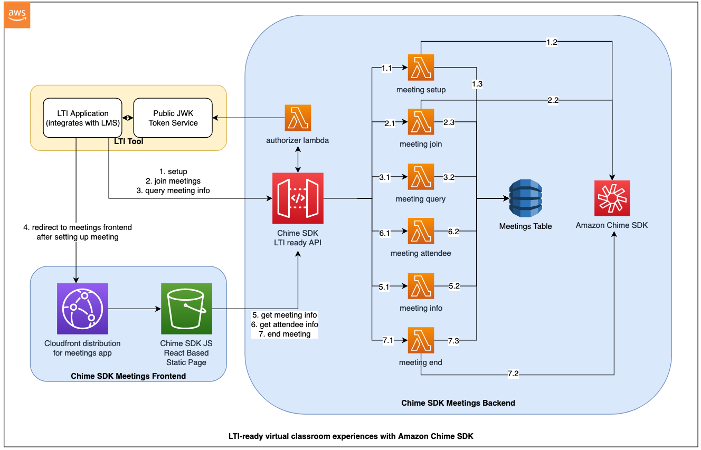

# Amazon Chime SDK Meetings Experience
This project provides resources to roll out infrastructure to add meeting capabilities to an existing [LTI](https://www.imsglobal.org/activity/learning-tools-interoperability) tool integrating with platforms such as Moodle, Canvas, or Blackboard. 

Using this sample repository, you can easily enable audio, video, and screenshare enabled meetings in your LTI based applications powered by [Amazon Chime SDK](https://aws.amazon.com/chime/chime-sdk/).

To set up and deploy this project please follow the [setup instructions](#deployment).

## What you get

This project uses AWS CDK to roll out 2 components: 
- `Backend` - [Amazon Chime SDK](https://aws.amazon.com/chime/chime-sdk/) backend, containing resources to create and manage meetings 
- `Frontend` - [Amazon Chime SDK JS](https://github.com/aws/amazon-chime-sdk-js) based frontend, which deploys a [React](https://reactjs.org/) based static website using [Amazon S3](https://aws.amazon.com/s3/) and [AWS CloudFront](https://aws.amazon.com/cloudfront/)

_**Note** - This repository provides the solution in the blue boxes below. For a sample solution that provides an LTI tool, see the [LTI Section](../lti-components/README.md)._

## What you need

The complete scenario requires you to have the following (either before or after the initial deployment of this application):

1. A configured LTI plugin in an externally hosted platform like a learning management system (LMS) such as Moodle, Canvas, Blackboard which supports [LTI v1.3](https://www.imsglobal.org/spec/lti/v1p3/#overview) or later.

2. An LTI tool which provides JWK token based authorization. A demo application can be found [here](../lti-components/README.md). 
    - Please install this application first, and save the value for the `Public JWK URL`. We will use it later in the deployment process.
    - To get started, please follow [these setup instructions](../lti-components/web/README.md) to deploy the LTI tool.

## Deployment

### Pre-requisites
- [node V12+](https://nodejs.org/en/download/)
- [npm](https://www.npmjs.com/get-npm)
- [AWS CLI](https://docs.aws.amazon.com/cli/latest/userguide/install-cliv2.html)
- [AWS CDK](https://docs.aws.amazon.com/cdk/latest/guide/getting_started.html#getting_started_install)
  - `npm install -g aws-cdk`
  - Be sure to have the latest version installed.  If you need to upgrade, uninstall with `npm uninstall -g aws-cdk` and then reinstall.
- [AWS CDK](https://docs.aws.amazon.com/cdk/latest/guide/bootstrapping.html)
  - `cdk bootstrap`
- Install the following dependencies in your environment
  - *ts-node* - `npm install -g ts-node`
  - *yalc* - `npm install -g yalc`
  - *typescript* - `npm install -g typescript --force`

### Steps to deploy
### Step 1) LTI plugin and tool setup (by Admin)
Please follow instructions provided in the [previous section](#what-you-need).

### Step 2) Amazon Chime SDK infrastructure setup (by Admin)
This step will deploy the backend and frontend stacks for setting up a meetings application based on Amazon Chime SDK. Clone this repository in your terminal and run the following commands:
- `cd lti-ready-virtual-classroom-with-amazon-chime-sdk/chime-sdk-components`
- Deploy the bash script with the `Public JWK URL` provided by the LTI tool in [this section](#what-you-need). You can choose either of the following options to deploy:
  - Interactive setup `./deploy.sh`
  - Express setup`./deploy.sh -i {JWK_URL}`
- Accept prompts for CDK deployment for both backend and frontend stacks

### Steps to test
Follow the instructions provided in the README for the LTI tool to test this set up.