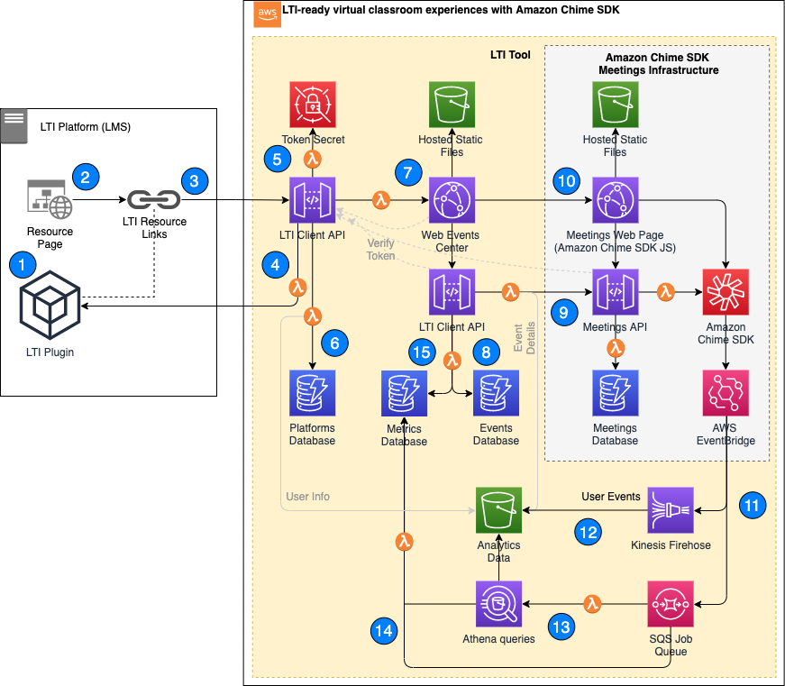

# LTI-ready virtual classroom experiences with Amazon Chime SDK

This project provides code resources to roll out a web application to AWS which integrates Chime web meetings into an [LTI](https://www.imsglobal.org/activity/learning-tools-interoperability) platform such as Moodle, Canvas, or Blackboard. To set up and deploy this project please follow the [setup instructions](./web/README.md).

## What you get

This project uses Amazon Amplify to roll out AWS Cloudformation stacks to cover all functional components which are illustrated inside the yellow box below - we call it the LTI tool. For an LMS system like Canvas or Moodle this application provides an LTI interface so it can be integrated as a plugin into its course or module pages as what LTI calls resource links. On the backend side this LTI tool acts as a client to utilize the Chime meeting web app as a communications tool for teachers and students. In itself, the tool has a web interface allowing teachers to schedule events, and launch and join Chime meeting instances from them. On top, the LTI tools subscribes to user events from Chime meetings e.g. meeting started, ended, attendee joined, left, started and stopped sharing screen etc. The tool will take these events to augment with relevant data like LTI user information and event details before aggregating metrics to present meaningful insight into Chime meeting activities.

## What you need

The complete scenario requires you to have the following (either before or after the initial deployment of this application):

1. A configured LTI plugin in an externally hosted platform like a learning management system (LMS) such as Moodle, Canvas, Blackboard which supports [LTI v1.3](https://www.imsglobal.org/spec/lti/v1p3/#overview) or later.

2. The Chime meetings web application.

To get started, please follow [these setup instructions](./web/README.md) to deploy the LTI tool.

## How it works

To better understand the technical components and their purpose in this sample let's walk through all steps necessary to start and join a Chime meeting as a teacher or student coming from an LMS.

### Step 1) LTI plugin setup (by Admin)

An Administrator sets up a new LTI plugin in an LMS by providing endpoint information from the LTI Client API. This process is described as part of the [setup instructions](./web/README.md).

### Step 2) LTI resource link creation (by Teacher)

Once the LTI plugin is set up and enabled in the LMS, teachers and faculty members are able to embed hyperlinks in various locations within the LMS e.g. on a course page. They may choose to label these links as _"Enter virtual classroom for course XY"_ etc.

### Step 3) Click on LTI resource link (by Teachers and Students)

Anyone with access to this LMS course page is now able to see and click on this link in order to enter this tools web page.

### Step 4) Verify incoming access request

As soon as the link is clicked the user will be forwarded to the LTI tool. An OpenID authorization is processed between the LMS on the left (the OpenID provider) and the LTI tool on the right (the OpenID client). The LTI tool verifies the authenticity of the incoming access request and receives some information about the source and the user's identity. Any newly verified LMS platform will get its own configuration profile in the LTI tool. Stored in DynamoDB these configuration profiles allow Administrators to maintain global settings like LMS endpoints but also default UX settings such as display formats for date and time.

### Step 5) Issue token with source and user info

Once the incoming request is verified the LTI tool extracts relevant information from the LMS OpenID token, such as course title, user name and roles. It translates the LTI schema into its own data structure and issues its own OpenID token using a private JWK which is securely stored in AWS Secrets Manager. At this point the LTI Client API becomes the new internal authority for verifying the user identity as it moves along all the following steps.

### Step 6) Cache user information

When a user enters the LTI tool from an LMS some relevant user information is securely stored in S3. The main purpose of storing user data in S3 is to later merge this information with user actions taken in Chime meetings to run insightful analytics on student engagement.

### Step 7) Enter Chime Events Center web interface

After the verification process is done the user who clicked on the link is forwarded to the LTI tools web interface. The LTI Client API also forwards its newly issued token with all relevant information about the user and the source (e.g. the course page).

### Step 8) Create, schedule and review events (Teacher, Students)

The web interface allows teachers to create and schedule events for their course such as an upcoming workshop. A teacher will add a title, a description, event runtime, and host information for the event. Students will see the scheduled events and their details. Event information is stored as data records in DynamoDB and accessed through an API which uses OpenID token authorization.

### Step 9) Start and join Chime meetings (Teacher, Students)

As soon as a scheduled event becomes current the web interface renders a "Start meeting" button for teachers, and "Join meeting" buttons for students. Clicking on these buttons call the Chime meetings API. This step will initiate a new Chime meeting. An OpenID token is used to secure access to Chime meeting resources.

When new meetings are initiated the LTI tool securely stores event details like event title in S3 for analytical purposes.

### Step 10) Enter Chime meeting (Teacher, Students)

Teachers and students who enter the newly created meeting by clicking on a "Join meeting" button are forwarded to the Chime meeting in their web browser. A new browser tab opens up. The user successfully entered a Chime meeting that was scheduled as an event for the course s/he's enrolled in the LMS.

### Step 11) Receive engagement events

While Chime meetings are running AWS propagates user event message to AWS EventBridge e.g. when a meeting started or ended, an attendee joined, dropped or left, and when an attendee starts and stops sharing video. The LTI tool subscribes to relevant events in two ways as described in step 12 and 13.

### Step 12) Process engagement events

EventBridge Chime event messages are sent to a Kinesis Firehose to store raw event data in S3.

### Step 13) Query engagement events

EventBridge Chime event messages are also sent to SQS to trigger a Lambda function execution. The Lambda function starts an Athena query to aggregate raw Chime events and augment with user information and event details. SQS is configured to deduplicate messages by meeting ID so that only 1 Athena query is executed per Chime meeting which propagated user activity within a certain time interval.

### Step 14) Process and cache query results

A Lambda function loads Athena query results into a DynamoDB table to cache aggegrated metrics per meeting. This Lambda function is triggered by an SQS queue message containing an Athena query execution id. The SQS message was sent by the Lambda function starting the Athena execution as described in step 13

### Step 15) Read and display Chime meeting engagement metrics

The web application reads from the cached results in DynamoDB and renders performance information about the Chime meeting in the web browser. Teachers get insights into user activities in Chime meetings in near realtime.
